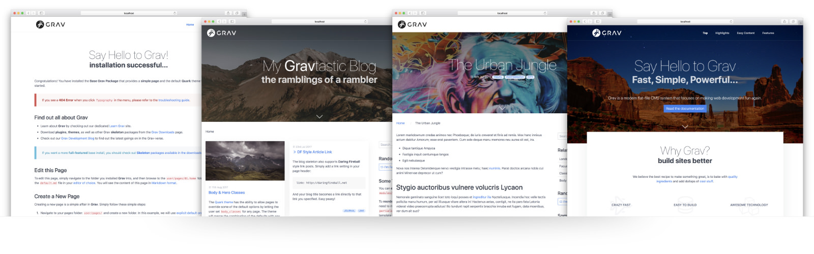

# Ms Theme

**MS** Theme for [Grav CMS](http://github.com/getgrav/grav).

## Description

MS Template

## Installation

* root dir
    * composer install
* theme dir
    * yarn install
    * copy .env.example and edit MIX_BS_PROXY
    * yarn run dev/prod/watch
